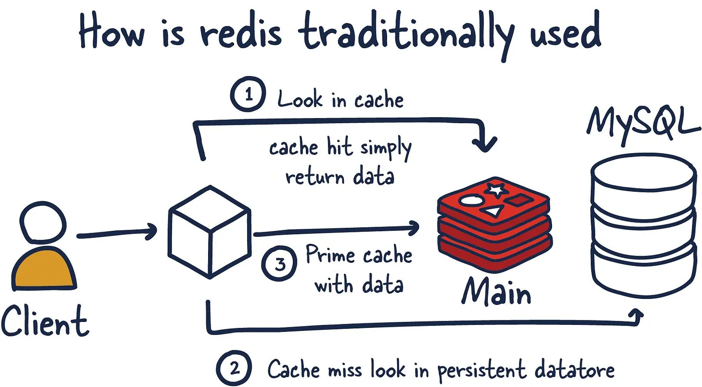

# EP - Cache con Redis

## Qué es Redis

Redis es una base de datos en memoria que permite almacenar datos de manera muy rápida y eficiente, y es ampliamente utilizada para caching, o almacenamiento en caché. La caché es una técnica que guarda temporalmente datos para reducir el tiempo y el costo de obtener información desde una base de datos principal, especialmente cuando se requiere acceder a esos datos de forma repetida.

## Caso de uso típico

En un escenario típico de uso de Redis como caché, el flujo funciona de la siguiente manera:

### Fujo

- **_cache hit_**: Cuando el cliente (que puede ser una aplicación o servicio) necesita acceder a un dato, primero verifica si este ya está en Redis. Este paso se llama **_cache hit_** si el dato se encuentra en la caché, y se devuelve inmediatamente al cliente sin realizar consultas adicionales.

- **_cache miss_**: Si Redis no contiene el dato solicitado (es un cache miss), la consulta se redirige al repositorio/servicio donde se encuentran los datos almacenados permanentemente. Este acceso suele ser mucho más lento que acceder a una caché en memoria.

- **_prime cache_**: Una vez que el repositorio/servico devuelve el dato solicitado, este se guarda en Redis para que, en futuras solicitudes, esté disponible directamente en la caché. Este proceso se llama "prime cache" o "inicializar la caché".

La ventaja de este flujo es que Redis almacena datos en memoria, lo que permite tiempos de respuesta rápidos. Así, Redis reduce la cantidad de consultas que necesita hacer a las base de datos persistente o servicios externos, mejorando el rendimiento general del sistema e incluso ahorrando costos.

### TTL (Time To Live)

Una característica importante de Redis como caché es la capacidad de establecer un TTL (Time To Live) para los datos almacenados. El TTL define un tiempo de expiración para cada clave almacenada en Redis, indicando cuánto tiempo debe conservarse el dato antes de ser eliminado automáticamente. Esto ayuda a mantener la caché actualizada con datos frescos y evita que se acumulen datos obsoletos o que la memoria se llene innecesariamente.

Por ejemplo, si un dato en la caché tiene un TTL de 5 minutos, Redis lo eliminará una vez transcurrido ese tiempo, obligando a la próxima consulta a hacer un cache miss y buscar el dato actualizado en la base de datos principal. El uso del TTL es fundamental para optimizar el rendimiento de la caché y asegurar que los datos en Redis sigan siendo relevantes y precisos.
